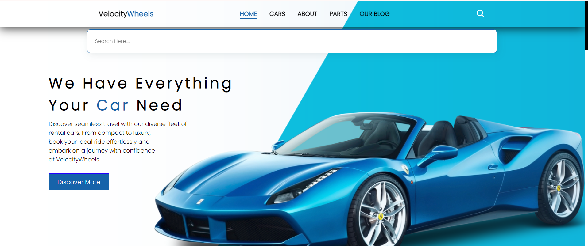
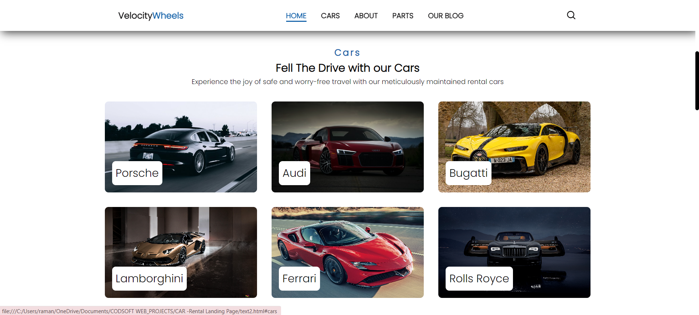
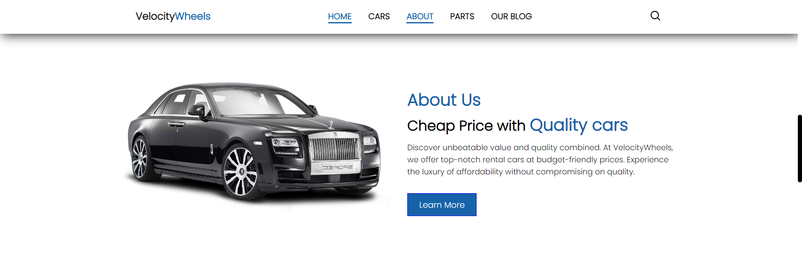
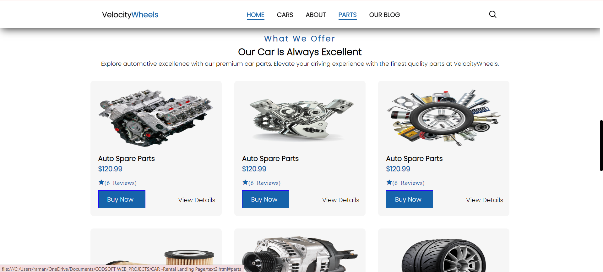
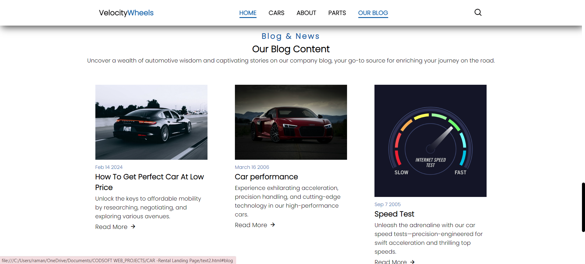
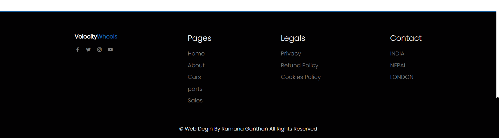

<h1>Description </h1>

Explore the world of Virtual Wheel -CarRental on GitHub - your go-to repository for a cutting-edge car rental website project! 🌐🚀 This repository houses the codebase that powers the seamless booking experience, diverse vehicle options, and transparent pricing of our DriveAway platform.

<h1>Screenshots</h1>
<ul>
  <li>
    <h2>On Desktop </h2>
     
     
     
     
     
     
 
  </li>

</ul>
